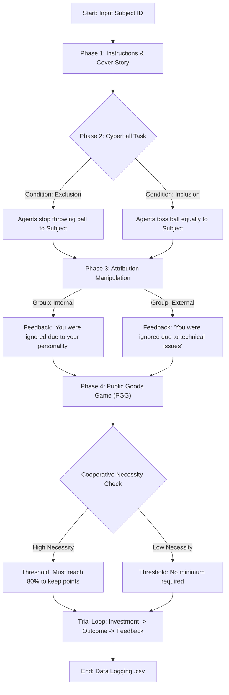

# The Impact of Social Exclusion on Cooperative Behavior

**Author:** Wentian Ye (Nanjing Normal University)  
**Status:** Undergraduate Thesis Project (2026)

## 📌 Project Overview

This repository contains the experimental source code for the graduation thesis titled **"The Impact of Social Exclusion on Cooperative Behavior: An Integrative Mechanism of Embodiment Effects, Attribution Styles, and Situational Constraints"**.

This study constructs a multi-level integrated model to explore how physiological states (defensive body postures), cognitive processing (attribution styles), and external rules (situational constraints) jointly regulate cooperative behavior following social exclusion.

## 🧪 Experimental Design

The experiment employs a quantitative mixed design utilizing two classic psychological paradigms:
1.  **Cyberball Paradigm:** Used to manipulate the experience of social exclusion vs. inclusion.
2.  **Public Goods Game (PGG):** Used to measure subsequent cooperative behavior.

### Key Variables
* **Body Posture:** Defensive (e.g., crossed arms) vs. Neutral (Manipulated physically/instructionally by the ID).
* **Attribution Style:** Internal vs. External (Manipulated via feedback instructions).
* **Cooperative Necessity:** High vs. Low (Manipulated via PGG threshold rules).

## ⚙️ Program Workflow

The experiment follows a linear sequence designed to measure the carry-over effects of social exclusion on cooperative decision-making. Below is the logic flow implemented in the Python scripts:


### 📂 File Structure & Condition Mapping

The repository includes Python scripts (developed using **PsychoPy**) corresponding to different experimental conditions. The filenames follow the convention `Condition_Attribution_Necessity`.

| Filename | Social Condition | Attribution Style | Cooperative Necessity | Description |
| :--- | :--- | :--- | :--- | :--- |
| `Exc_Int_Low.py` | **Exclusion** | **Internal** | **Low** | Excluded participants given internal attribution feedback; PGG has low survival threshold. |
| `Exc_Int_High.py` | **Exclusion** | **Internal** | **High** | Excluded participants given internal attribution feedback; PGG has high survival threshold. |
| `Exc_Ext_Low.py` | **Exclusion** | **External** | **Low** | Excluded participants given external attribution feedback; PGG has low survival threshold. |
| `Exc_Ext_High.py` | **Exclusion** | **External** | **High** | Excluded participants given external attribution feedback; PGG has high survival threshold. |
| `Inc_Int_Low.py` | **Inclusion** | **Internal** | **Low** | Control condition (Included) with internal attribution consistency check. |
| `Inc_Ext_Low.py` | **Inclusion** | **External** | **Low** | Control condition (Included) with external attribution consistency check. |

> **Note:** The **Body Posture** variable (Defensive vs. Neutral) is manipulated via experimenter instruction and physical constraints before the task begins. It applies across these scripts depending on the participant's assignment group.

## 🛠️ Prerequisites & Installation

To execute these experiments, a Python environment with the PsychoPy library is required. Additionally, the Cyberball 5 must be installed configured with Condition 1 set to 'Exclusive' and Condition 2 set to 'Inclusive'。

### Recommended Environment
* **Cyberball 5:** [Download Here](https://www.empirisoft.com/cyberball.aspx) (Recommended for stability).
* **PsychoPy Standalone:** [Download Here](https://www.psychopy.org/download.html) (Recommended for stability).
* **Python Version:** Python 3.8+ (if running from source).

### Dependencies
If you are running from a standard Python environment, install the required packages:
```bash
pip install psychopy pandas numpy openpyxl
